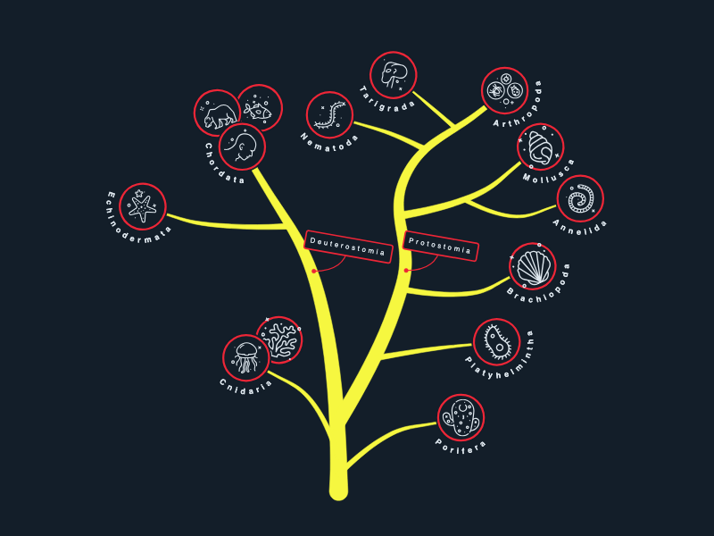

# JointJS: Tree of Life

Explore the evolutionary relationships between different organisms with our interactive tree of life. For those who appreciate the technical aspects of this demo, please note that it combines JointJS links with the Perfect-freehand library to create pressure-sensitive freehand lines. The organic style of the links is achieved by gradually decreasing the pressure from the beginning to the end of each link. Additionally, we used an SVGTextPathElement to wrap text around the nodes.

## Available Versions

- [TypeScript](./ts/)

## Screenshot

