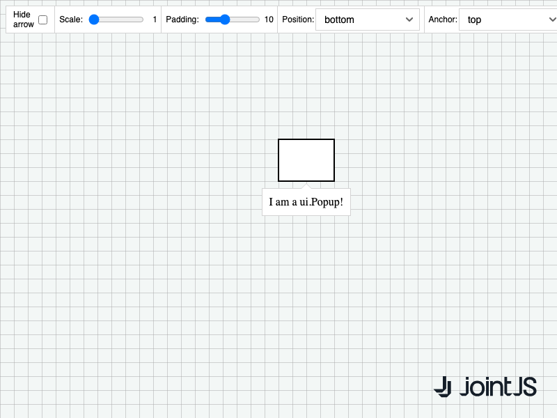

# JointJS+: ui.Popup 

Curious about how to control the appearance of popups? See how you can change their position, size, anchor, padding and more.

This demo is also available online at [jointjs.com](https://jointjs.com/demos/ui-popup).

## Available Versions

- [JavaScript](./js/)

## Screenshot

