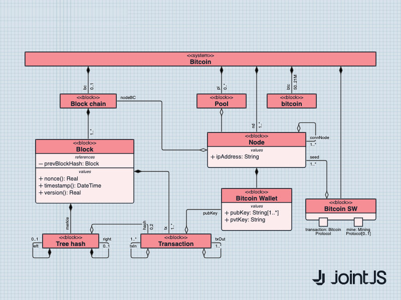

# JointJS+: UML Class Diagram 

A Unified Modeling Language (UML) Class diagram describes a system by visualizing the different types of objects within a system. JointJS, a JavaScript/Typescript diagramming library, can help users easily build this type of static diagram that describes the structure of a system. Using familiar SVG attributes, or custom JointJS properties, you will be able to visualize classes, their attributes, operations and relationships of a given system.

This demo is also available online at [jointjs.com](https://jointjs.com/demos/uml-class-diagrams).

## Available Versions

- [JavaScript](./js/)

## Screenshot

