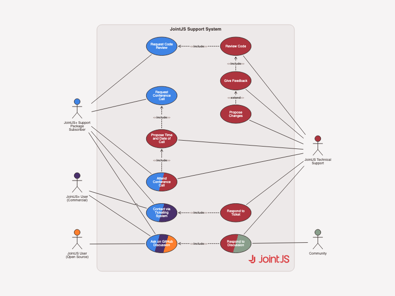

# JointJS: UML Use Case Diagram

A UML Use Case diagram is a graphical representation of how users interact with a system, depicting the various actors and their corresponding use cases. With our JavaScript diagramming library, building a UML Use Case diagram is made easy and intuitive through our drag-and-drop interface and extensive library of pre-built shapes and symbols.

This demo is also available online at [jointjs.com](https://jointjs.com/demos/use-case-diagram).

## Available Versions

- [JavaScript](./js/)

## Screenshot

