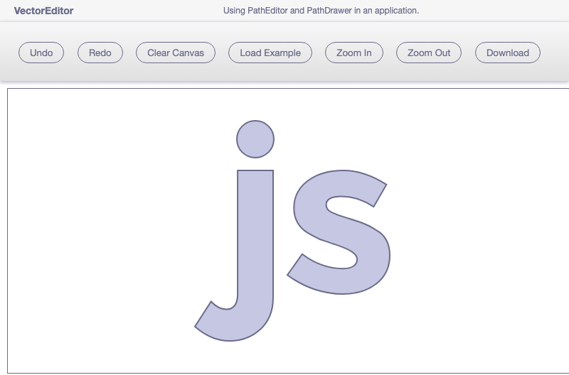

# JointJS+: Vector Editor 

The Vector Editor demo is an application which allows the user to draw and edit SVG path elements on demand.

This demo is also available online at [jointjs.com](https://jointjs.com/demos/vector-editor).

## Available Versions

- [JavaScript](./js/)

## Screenshot

