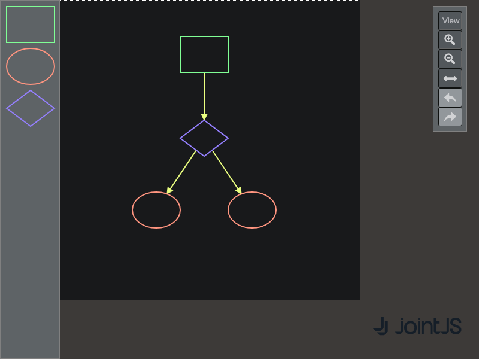

# JointJS+: View/Edit Mode 

Do you need to switch a diagram from read-only to fully editable mode, e.g. based on user permissions? Here is a demo of how to structure your application to make switching between view and edit mode easier.

This demo is also available online at [jointjs.com](https://jointjs.com/demos/view-edit-mode).

## Available Versions

- [JavaScript](./js/)

## Screenshot

