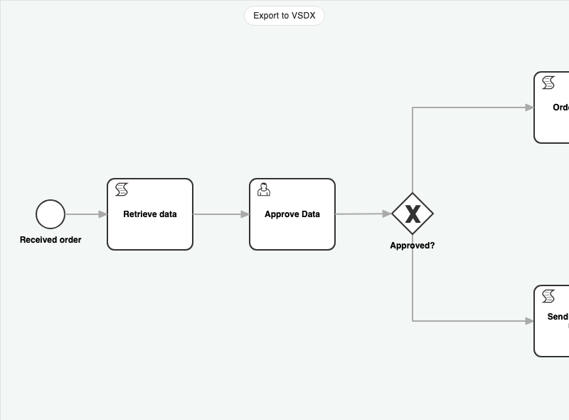

# Visio BPMN Export

The Visio BPMN Export demo exports a Microsoft Visio VSDX file and converts JointJS cells to Visio Shapes.

This demo is also available online at [jointjs.com](https://jointjs.com/demos/visio-bpmn-export).

## Available Versions

- [JavaScript](./js/)
- [TypeScript](./ts/)

## Screenshot

