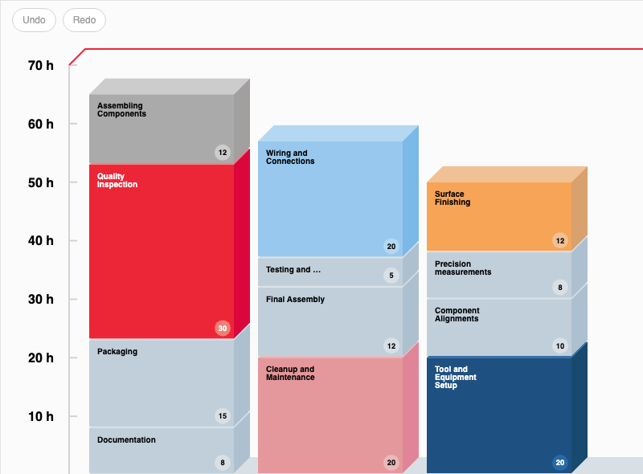

# JointJS+: Yamazumi 3D 

A Yamazumi chart is a stacked bar chart used primarily in lean manufacturing and process analysis to visualize the balance of work between different steps in a process. The word "Yamazumi" is Japanese and translates as "to stack up." In this chart, each bar represents an individual process step, and the height of each segment within a bar corresponds to the time taken for that portion of the process. The primary purpose of the Yamazumi chart is to identify and eliminate waste, such as waiting times or overproduction, by highlighting imbalances and inefficiencies in the process. By stacking the activities, one can easily compare the work content across different steps (operators in our case) and make improvements to create a smoother, more balanced flow.

This demo is also available online at [jointjs.com](https://jointjs.com/demos/yamazumi-3d).

## Available Versions

- [JavaScript](./js/)
- [TypeScript](./ts/)

## Screenshot

